# IMS — Incident Management System

> **Zeotap Infrastructure / SRE Intern Assignment**
> Built by Shrinidhi | [GitHub Repository](https://github.com/Shrinidhi972004/ims)

---

## Overview

IMS is a production-grade **Incident Management System** designed to monitor a complex distributed stack — APIs, MCP Hosts, Distributed Caches, Async Queues, RDBMS, and NoSQL stores — and manage failure mediation workflows end to end.

The system ingests high-volume signals, debounces them intelligently, processes them asynchronously, alerts the right responders, and provides a workflow-driven UI to track every incident from `OPEN` to `CLOSED` with a mandatory Root Cause Analysis.

---

## Requirements Coverage

| Requirement | Implementation |
|---|---|
| High-throughput signal ingestion | HTTP POST `/api/v1/signals` + batch endpoint |
| Handle bursts up to 10,000 signals/sec | Bounded channel (50k cap), 20 goroutine workers, non-blocking TryEnqueue |
| System cannot crash if persistence is slow | 429 backpressure — queue full returns error, never blocks |
| Debounce: 100 signals → 1 WorkItem | `sync.Map` (hot path) + Redis (durable), 10s window |
| All signals linked to WorkItem in NoSQL | MongoDB audit log with WorkItem reference |
| Raw signal audit log (Data Lake) | MongoDB — all raw payloads stored |
| Structured WorkItems + RCA (Source of Truth) | PostgreSQL with ACID transactions |
| Real-time dashboard cache (Hot Path) | Redis with 3s TTL |
| Timeseries aggregations | TimescaleDB hypertable + continuous aggregate |
| Alerting Strategy Pattern | P0Strategy (PagerDuty), P1Strategy (Slack), P2Strategy (Email) |
| State Pattern: OPEN→INVESTIGATING→RESOLVED→CLOSED | `workflow.Machine` with 4 concrete state structs |
| Async Processing | Goroutine pool with fan-out to all stores |
| Mandatory RCA before CLOSED | `Machine.Transition()` rejects CLOSED without valid RCA |
| MTTR Calculation | Calculated from RCA start/end timestamps |
| Live Feed sorted by severity | Dashboard + Incidents page, P0 first |
| Incident Detail with raw signals | MongoDB signals shown in timeline |
| RCA Form with datetime pickers | Section 1 with start/end pickers + future time validation |
| Rate limiting on ingestion | Token bucket, 100 req/s per IP, X-RateLimit-* headers |
| `/health` endpoint | Returns all store status + queue + worker stats |
| Throughput metrics every 5s | Worker pool logs signals/sec to console |
| Concurrency primitives | goroutines, channels, sync.Map, atomic.Int64 |
| Unit tests for RCA validation | 18 tests, all passing with `-race` flag |
| Retry logic for DB writes | 3 attempts, exponential backoff on all stores |
| README with Architecture Diagram | See below |
| Docker Compose setup | `docker compose up --build` |
| Backpressure section | See below |
| Sample data / simulate script | `scripts/simulate_failure.sh` |
| Prompts/Spec/Plans checked in | `docs/prompts.md`, `docs/spec.md` |

---

## Architecture

```
                    ┌─────────────────────────────────────────────────┐
                    │              IMS Architecture                    │
                    └─────────────────────────────────────────────────┘

  Signals (HTTP)
       │
       ▼
┌─────────────┐     Token Bucket      ┌──────────────────────┐
│  Rate       │──── Rate Limiter ────▶│  Signal Ingestion    │
│  Limiter    │     100 req/s/IP      │  POST /api/v1/signals│
└─────────────┘                       └──────────┬───────────┘
                                                  │
                                    Debounce Check (sync.Map + Redis)
                                    10s window per Component ID
                                                  │
                                       ┌──────────▼──────────┐
                                       │   Bounded Channel   │
                                       │   Queue (50k cap)   │
                                       │   Non-blocking      │
                                       │   TryEnqueue        │
                                       └──────────┬──────────┘
                                                  │
                              ┌───────────────────┼───────────────────┐
                              ▼                   ▼                   ▼
                       Worker Pool          Worker Pool          Worker Pool
                       (Goroutine 1)        (Goroutine 2)    ... (Goroutine 20)
                              │                   │                   │
                    ┌─────────┼───────────────────┼───────────────────┤
                    ▼         ▼                   ▼                   ▼
             ┌──────────┐ ┌──────────┐     ┌──────────┐       ┌──────────┐
             │ MongoDB  │ │PostgreSQL│     │TimescaleDB│      │  Redis   │
             │ Raw      │ │WorkItems │     │Timeseries │      │Dashboard │
             │ Signals  │ │RCA       │     │Aggregates │      │Cache     │
             │ Audit Log│ │Source of │     │           │      │Debounce  │
             └──────────┘ │  Truth   │     └──────────┘       └──────────┘
                          └──────────┘

                    ┌─────────────────────────────────┐
                    │         Strategy Pattern        │
                    │  P0 → PagerDuty (RDBMS/Queue)  │
                    │  P1 → Slack     (API/MCP Host) │
                    │  P2 → Email     (Cache)         │
                    └─────────────────────────────────┘

                    ┌─────────────────────────────────┐
                    │          State Machine          │
                    │  OPEN → INVESTIGATING           │
                    │       → RESOLVED               │
                    │       → CLOSED (RCA required)  │
                    └─────────────────────────────────┘

                    ┌─────────────────────────────────┐
                    │        React Frontend           │
                    │  Dashboard · Incidents · RCA    │
                    │  WebSocket live updates         │
                    │  3s polling fallback            │
                    └─────────────────────────────────┘
```

---

## Tech Stack

| Layer | Technology | Reason |
|---|---|---|
| Backend | Go 1.22 + Fiber v2 | High concurrency, low latency |
| Source of Truth | PostgreSQL + TimescaleDB | ACID transactions + timeseries |
| Audit Log | MongoDB 7.0 | Flexible schema for raw signals |
| Cache | Redis 7.2 | Sub-millisecond hot-path reads |
| Frontend | React 18 + Vite | Real-time UI with WebSocket |
| Observability | Prometheus + Grafana | Metrics and dashboards |
| Container | Docker + Docker Compose | Single-command local deployment |

---

## Backpressure Handling

When the persistence layer is slow, the signal ingestion pipeline handles backpressure at three levels:

**Level 1 — Rate Limiter**
Token bucket algorithm at 100 req/s per IP. Returns `429 Too Many Requests` with `X-RateLimit-Remaining` and `Retry-After` headers before signals even enter the system.

**Level 2 — Bounded Channel Queue**
A buffered Go channel with 50,000 capacity acts as the in-memory buffer. `TryEnqueue` is non-blocking — if the channel is full it increments `signals_dropped_total` and returns immediately. The system **never blocks** on a full queue.

**Level 3 — Debounce Window**
If 100 signals arrive for the same Component ID within 10 seconds, only 1 WorkItem is created. All subsequent signals are linked to the existing WorkItem in MongoDB. This prevents WorkItem explosion under signal storms.

```
Signal Storm (10,000 signals/sec)
         │
         ▼
Rate Limiter ──── 429 if > 100 req/s/IP
         │
         ▼
Debounce ──── Same ComponentID? Link to existing WorkItem
         │
         ▼
Queue ──── Full? Drop + increment counter
         │
         ▼
Workers ──── 20 goroutines drain queue
```

---

## Deployment 1 — Docker Compose (Local)

### Prerequisites
- Docker and Docker Compose installed
- Ports 3000, 8080, 5432, 27017, 6379 available

### Quick Start

```bash
# Clone the repository
git clone https://github.com/Shrinidhi972004/ims.git
cd ims

# Start all services
docker compose up --build
```

### Simulate a Failure

```bash
# Get auth token
TOKEN=$(curl -s -X POST http://localhost:8080/api/v1/auth/signup \
  -H 'Content-Type: application/json' \
  -d '{"username":"admin","password":"admin123"}' | python3 -c "import sys,json; print(json.load(sys.stdin)['token'])")

# Run failure simulation
./scripts/simulate_failure.sh http://localhost:8080 $TOKEN
```

The script simulates:
- **Phase 1:** RDBMS_PRIMARY outage — 150 signals → 1 P0 WorkItem (debounce working)
- **Phase 2:** MCP_HOST_02 cascade failure — 50 signals → 1 P1 WorkItem
- **Phase 3:** CACHE_CLUSTER_01 miss spike — 30 signals → 1 P2 WorkItem

---

### Screenshots

#### 1. Docker Compose Up + Simulate Script Running
> `docker compose up --build` followed by `./scripts/simulate_failure.sh`

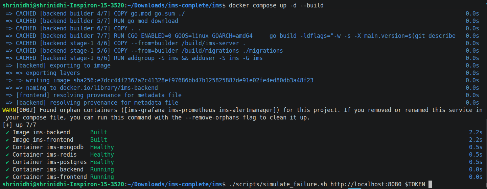

---

#### 2. Login / Signup Page
> Professional split-panel login with IMS branding

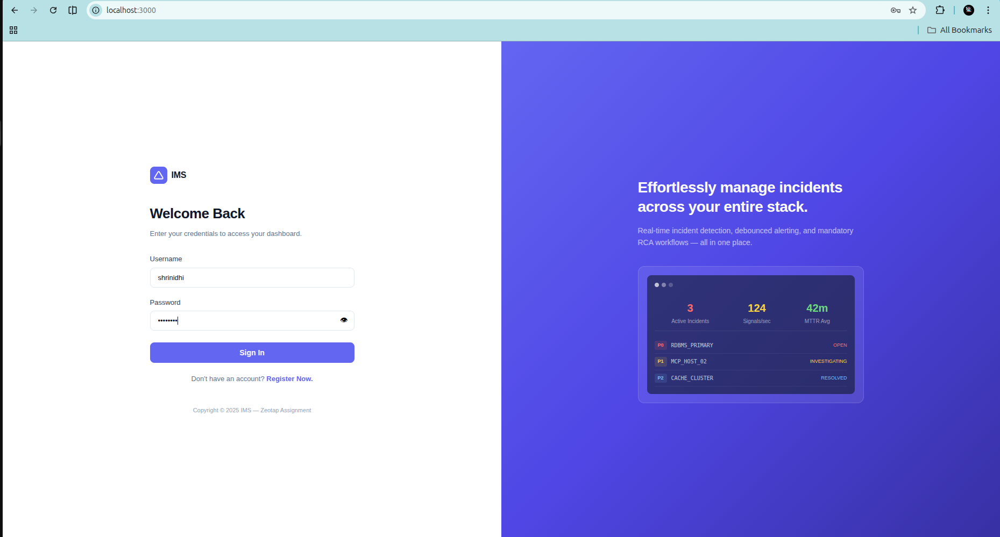

---

#### 3. Dashboard — Incoming Signals
> Real-time dashboard showing 3 active incidents after simulate script

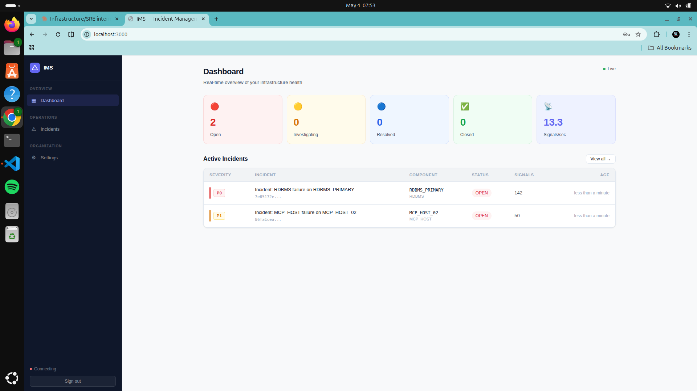

---

#### 4. Incidents Page
> All incidents sorted by severity — P0, P1, P2 with status badges

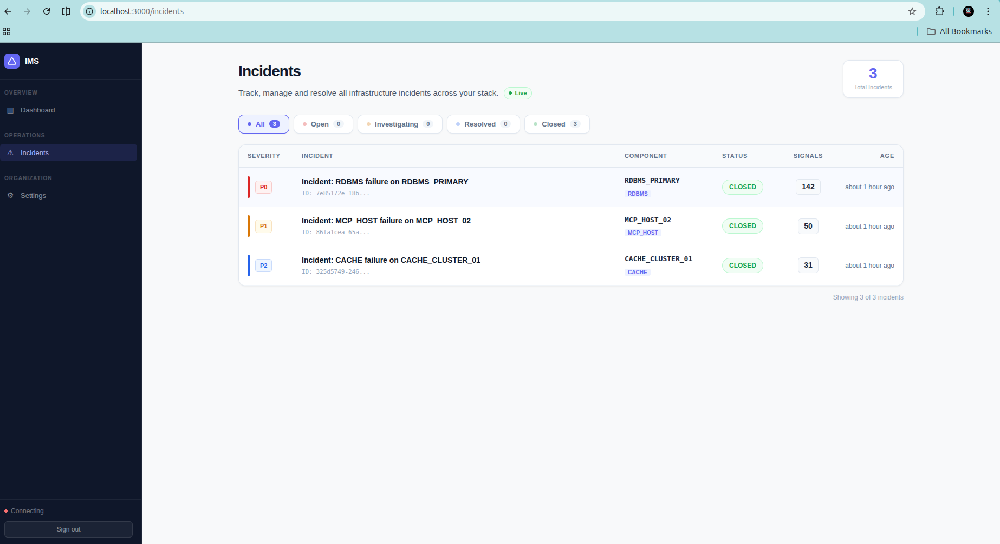

---

#### 5. Incident Detail — OPEN State
> P0 incident timeline showing signals from MongoDB and state machine

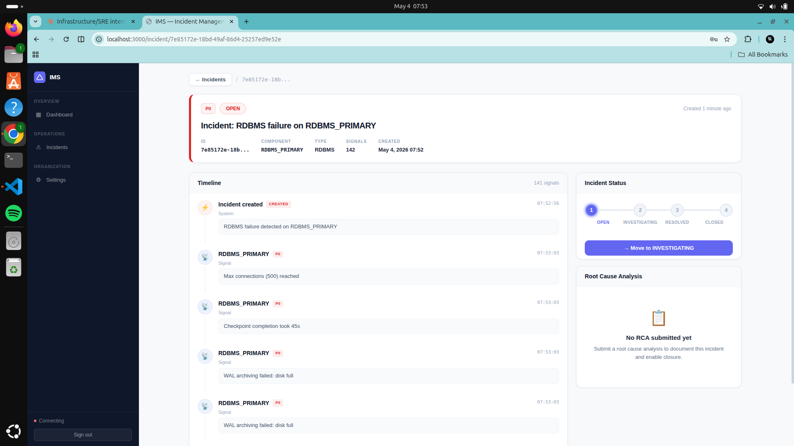

---

#### 6. Incident Detail — INVESTIGATING State
> After clicking "Move to INVESTIGATING"

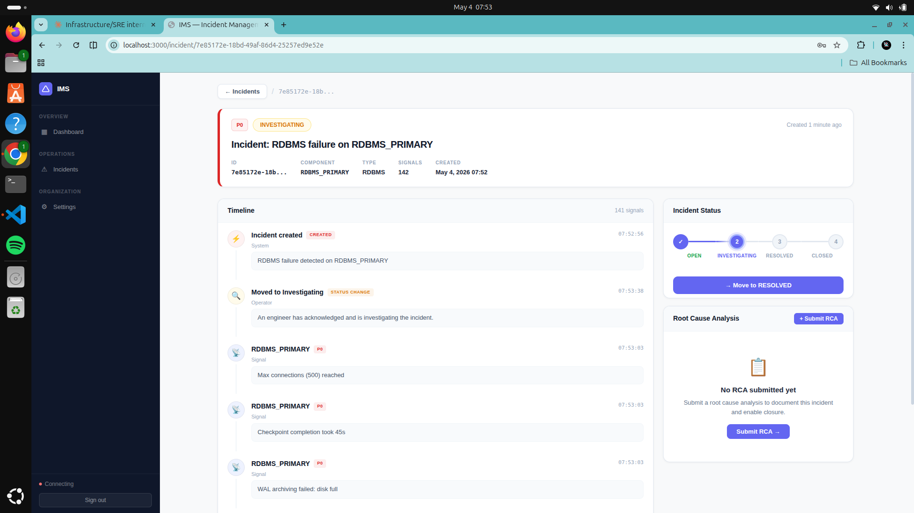

---

#### 7. RCA Form — Filling Out
> Root Cause Analysis form with datetime pickers and category selection

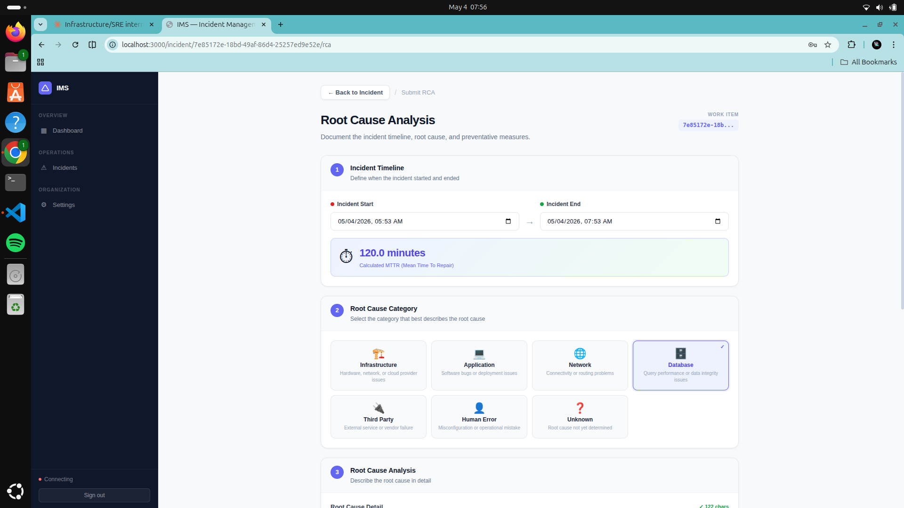

---

#### 8. RCA Form — Completed
> All sections filled — MTTR preview shows calculated repair time

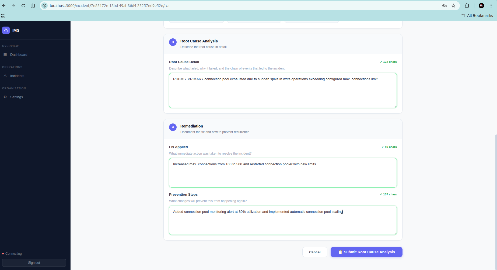

---

#### 9. RCA Submitted Successfully
> Success screen after RCA submission

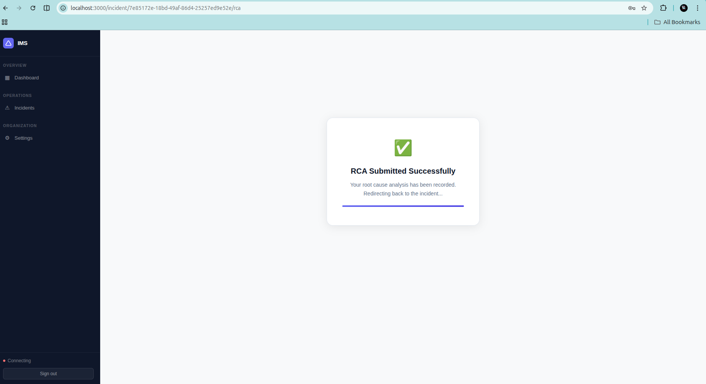

---

#### 10. Incident Detail — RCA Summary
> Incident detail showing the submitted RCA with all fields

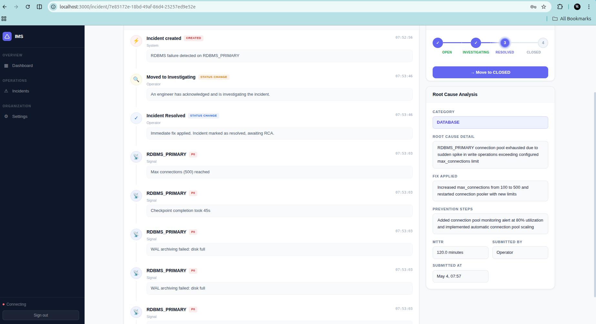

---

#### 11. Incident — CLOSED State
> MTTR badge appears in header after closing

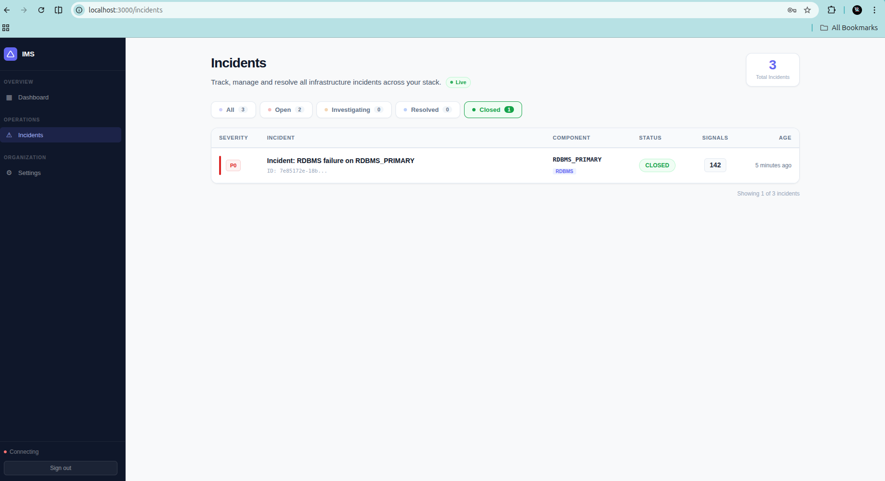

---

#### 12. Incidents Page — Open Filter (2 remaining)
> After closing P0, only 2 incidents visible in Open filter

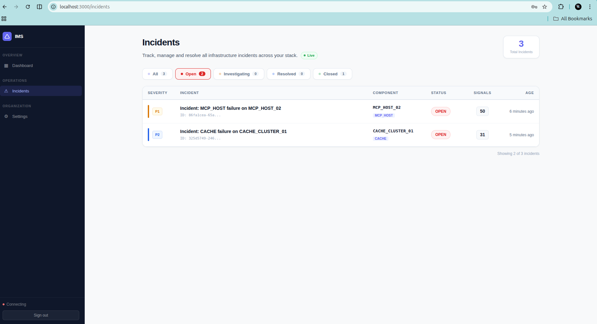

---

#### 13. All Incidents Closed
> Closed tab showing all 3 incidents resolved with MTTR

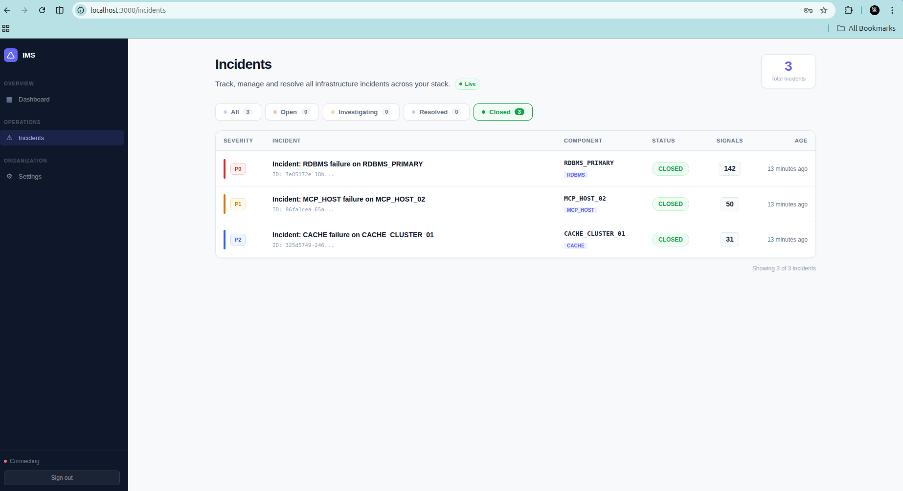

---

#### 13. Settings Dashboard
> Showing all the techstacks and metrics


---

### Service URLs

| Service | URL | Credentials |
|---|---|---|
| IMS Frontend | http://localhost:3000 | Register any username/password |
| IMS Backend API | http://localhost:8080 | JWT Bearer token |
| Health Check | http://localhost:8080/health | No auth required |
| Prometheus Metrics | http://localhost:8080/metrics | No auth required |

---

## Running Tests

```bash
cd backend
go test -v -race -count=1 ./internal/models/...
```

Expected output: **18 tests passing** covering RCA validation, MTTR calculation, and boundary conditions.

---

## API Reference

| Method | Endpoint | Description |
|---|---|---|
| POST | `/api/v1/auth/signup` | Register new user |
| POST | `/api/v1/auth/login` | Login and get JWT |
| POST | `/api/v1/signals` | Ingest a signal |
| POST | `/api/v1/signals/batch` | Ingest signals in batch |
| GET | `/api/v1/workitems` | List all work items |
| GET | `/api/v1/workitems/:id` | Get work item with signals and RCA |
| PUT | `/api/v1/workitems/:id/transition` | Transition state |
| POST | `/api/v1/workitems/:id/rca` | Submit RCA |
| GET | `/api/v1/dashboard` | Get dashboard stats |
| GET | `/health` | System health check |
| GET | `/metrics` | Prometheus metrics |
| WS | `/ws` | WebSocket for live updates |

---

## Project Structure

```
ims/
├── backend/
│   ├── cmd/server/main.go
│   ├── internal/
│   │   ├── models/        # WorkItem, RCA, Signal + 18 unit tests
│   │   ├── store/         # PostgreSQL, MongoDB, Redis stores
│   │   ├── queue/         # Bounded channel queue
│   │   ├── ingestion/     # Signal ingestion handler
│   │   ├── worker/        # Goroutine worker pool
│   │   ├── workflow/      # State machine (State Pattern)
│   │   ├── alerting/      # Alert dispatcher (Strategy Pattern)
│   │   └── api/           # HTTP routes and handlers
│   └── migrations/        # SQL schema
├── frontend/
│   └── src/
│       ├── pages/         # Dashboard, Incidents, RCAForm, Settings
│       ├── components/    # Sidebar
│       ├── hooks/         # useWebSocket
│       └── lib/           # API client
├── scripts/
│   ├── simulate_failure.sh
│   └── sample_events.json
├── docs/
│   ├── architecture.md
│   ├── prompts.md
│   ├── spec.md
│   ├── runbook.md
│   ├── slo.md
│   └── screenshots/
├── helm/                  # Kubernetes Helm chart
├── argocd/                # ArgoCD GitOps manifests
├── terraform/             # AWS infrastructure (IaC)
├── docker-compose.yml
└── README.md
```

---

## Bonus — DevOps / SRE / GitOps

> See [`feat/bonus-enhancements`](https://github.com/Shrinidhi972004/ims/tree/feat/bonus-enhancements) branch for full bonus implementation.

- **Helm Chart** — production-grade Kubernetes deployment with HPA, PDB, pod anti-affinity, security contexts, init containers
- **ArgoCD** — full GitOps pipeline with automated sync, self-heal, and prune from GitHub
- **GitHub Actions CI/CD** — `go test -race`, Docker build + push to GHCR on every push
- **kube-prometheus-stack** — Prometheus + Grafana + Alertmanager deployed via Helm
- **Slack Alerting** — P0/P1/P2 alerts routed to dedicated Slack channels via Alertmanager
- **Terraform** — modular AWS infrastructure (VPC, EKS, ECR, RDS PostgreSQL, ElastiCache Redis, DocumentDB)
- **System Settings page** — real-time health dashboard with queue stats, worker pool, memory usage, goroutine count
- **SLO definitions** — `docs/slo.md` with error budgets and MTTR targets
- **Incident runbook** — `docs/runbook.md` with P0/P1/P2 response procedures