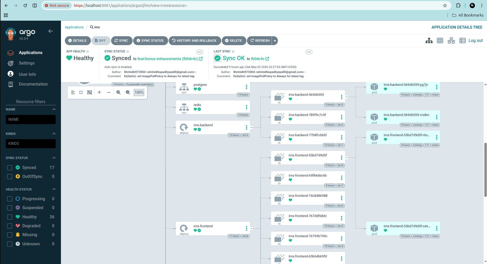
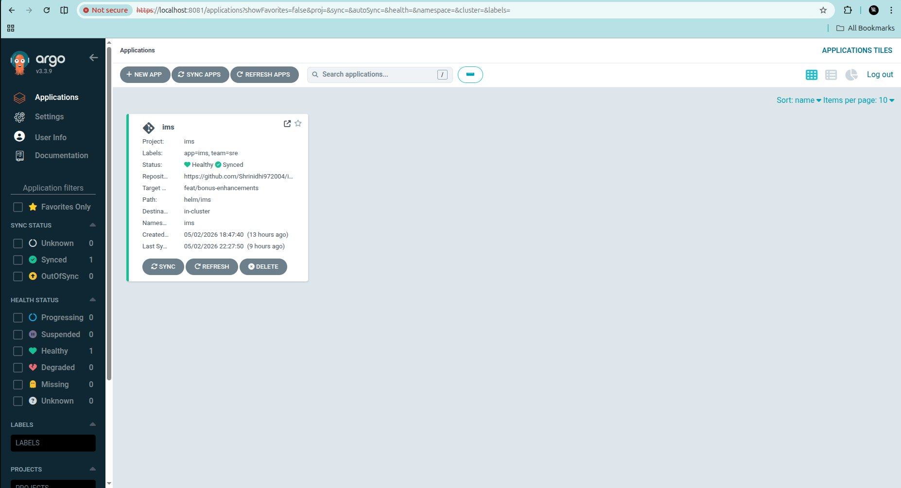
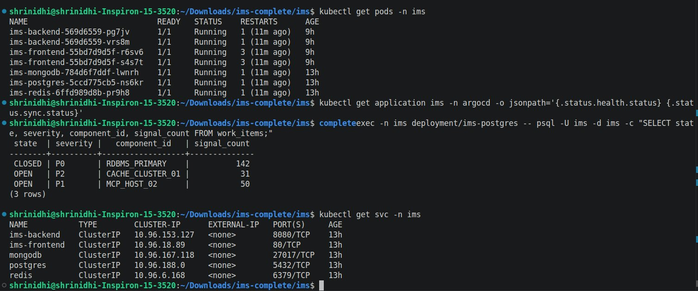
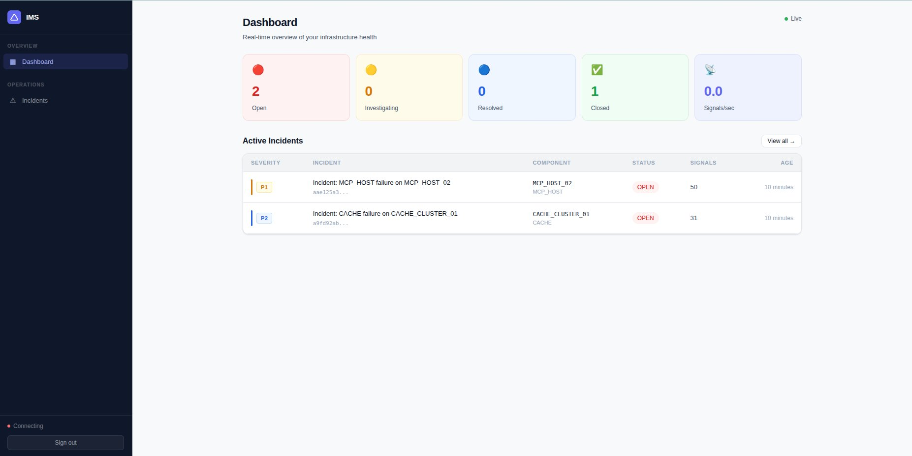

# IMS Helm Chart — Kubernetes Deployment Guide

This Helm chart deploys the complete IMS (Incident Management System) stack to any Kubernetes cluster. It includes the backend, frontend, and all required data stores — fully configured and production-ready.

---

## What Gets Deployed

| Component | Image | Description |
|---|---|---|
| `ims-backend` | `ghcr.io/shrinidhi972004/ims-backend:latest` | Go API server — 2 replicas with HPA |
| `ims-frontend` | `ghcr.io/shrinidhi972004/ims-frontend:latest` | React + Nginx — 2 replicas |
| `postgres` | `timescale/timescaledb:latest-pg16` | Source of truth — WorkItems + RCA |
| `mongodb` | `mongo:7.0` | Raw signal audit log |
| `redis` | `redis:7.2-alpine` | Dashboard cache + debounce |

---

## Prerequisites

- Kubernetes cluster (tested on kind v1.35.0, compatible with EKS/GKE/AKS)
- `kubectl` configured and pointing to your cluster
- Helm 3.x installed
- ArgoCD installed (optional — for GitOps deployment)

---

## Quick Start

### Option 1 — Deploy with Helm directly

```bash
# Create namespace
kubectl create namespace ims

# Install the chart
helm install ims ./helm/ims --namespace ims

# Watch pods come up
kubectl get pods -n ims -w
```

### Option 2 — Deploy with ArgoCD (GitOps)

```bash
# Install ArgoCD
kubectl create namespace argocd
kubectl apply -n argocd -f https://raw.githubusercontent.com/argoproj/argo-cd/stable/manifests/install.yaml

# Wait for ArgoCD to be ready
kubectl wait --for=condition=available --timeout=300s deployment/argocd-server -n argocd

# Get admin password
kubectl -n argocd get secret argocd-initial-admin-secret \
  -o jsonpath="{.data.password}" | base64 -d && echo

# Apply IMS project and application
kubectl apply -f argocd/project.yaml
kubectl apply -f argocd/application.yaml
```

ArgoCD automatically syncs from the `feat/bonus-enhancements` branch on every push. Self-heal and prune are enabled.

---

## Access the Application

```bash
# Frontend UI
kubectl port-forward svc/ims-frontend -n ims 3002:80 &

# Backend API
kubectl port-forward svc/ims-backend -n ims 8082:8080 &

# ArgoCD UI
kubectl port-forward svc/argocd-server -n argocd 8081:443 &
```

| Service | URL |
|---|---|
| IMS Frontend | http://localhost:3002 |
| IMS Backend API | http://localhost:8082 |
| ArgoCD UI | https://localhost:8081 |

---

## Verify Deployment

```bash
# Check all pods running
kubectl get pods -n ims

# Check all services
kubectl get svc -n ims

# Check backend health
curl http://localhost:8082/health | jq .

# Check work items in DB
kubectl exec -n ims deployment/ims-postgres -- \
  psql -U ims -d ims -c "SELECT state, severity, component_id, signal_count FROM work_items;"

# Check ArgoCD sync status
kubectl get application ims -n argocd \
  -o jsonpath='{.status.health.status} {.status.sync.status}'
```

---

## Screenshots

### ArgoCD Application — Healthy and Synced

> Status: **Healthy** | Sync: **Synced** to `feat/bonus-enhancements`
> Repo: `https://github.com/Shrinidhi972004/ims` | Path: `helm/ims`
> Auto-sync enabled with self-heal and prune



---

### ArgoCD Resource Tree — All 36 Resources Healthy

> Full GitOps deployment tree showing all Kubernetes resources managed by ArgoCD.
> Services, Deployments, ReplicaSets, Pods — all green.
> Last sync: `fix(helm): set imagePullPolicy to Always for latest tag`



---

### All Pods Running + Work Items in PostgreSQL

> `kubectl get pods -n ims` — 7 pods all 1/1 Running
> `kubectl get svc -n ims` — all 5 services with ClusterIPs
> Work items confirmed in PostgreSQL after simulate script



---

### IMS Dashboard Running on Kubernetes

> Live dashboard accessible via port-forward after Helm deployment.
> Shows real P1 and P2 incidents created by the simulate script.
> Stat cards: 2 Open, 0 Investigating, 0 Resolved, 1 Closed



---

## Production Features

| Feature | Details |
|---|---|
| **HPA** | Backend scales 2→10 replicas at 70% CPU |
| **PodDisruptionBudget** | Minimum 1 backend available during node drains |
| **Pod Anti-Affinity** | Backend pods spread across nodes |
| **Security Context** | Non-root user, readOnlyRootFilesystem, drop ALL capabilities |
| **Init Containers** | Backend waits for Postgres, MongoDB, Redis before starting |
| **Liveness + Readiness Probes** | All services health-checked |
| **PersistentVolumeClaims** | Postgres 5Gi, MongoDB 5Gi, Redis 1Gi |
| **Rolling Updates** | Zero downtime — maxUnavailable: 0 |
| **Prometheus Annotations** | Auto-scrape configured on backend pods |
| **imagePullPolicy: Always** | Ensures latest image pulled on every restart |

---

## GitOps Flow

```
Developer pushes to feat/bonus-enhancements
              ↓
GitHub Actions CI
  - go test -race ./...
  - docker build backend + frontend
  - push to ghcr.io/shrinidhi972004/ims-*:latest
              ↓
ArgoCD detects changes (polls every 3 minutes)
              ↓
ArgoCD syncs Helm chart to cluster
  - Rolling update on backend + frontend
  - Self-heals any manual configuration drift
  - Prunes resources deleted from Git
              ↓
IMS running on Kubernetes ✅
```

---

## Customise Values

```bash
# Scale replicas
helm upgrade ims ./helm/ims --set replicaCount=3

# Use specific image tag
helm upgrade ims ./helm/ims \
  --set image.backend.tag=abc1234 \
  --set image.frontend.tag=abc1234

# Override JWT secret
helm upgrade ims ./helm/ims \
  --set jwt.secret=my-production-secret

# Increase worker count
helm upgrade ims ./helm/ims \
  --set backend.workerCount=50
```

---

## Uninstall

```bash
helm uninstall ims --namespace ims
kubectl delete namespace ims
```